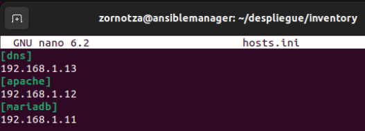
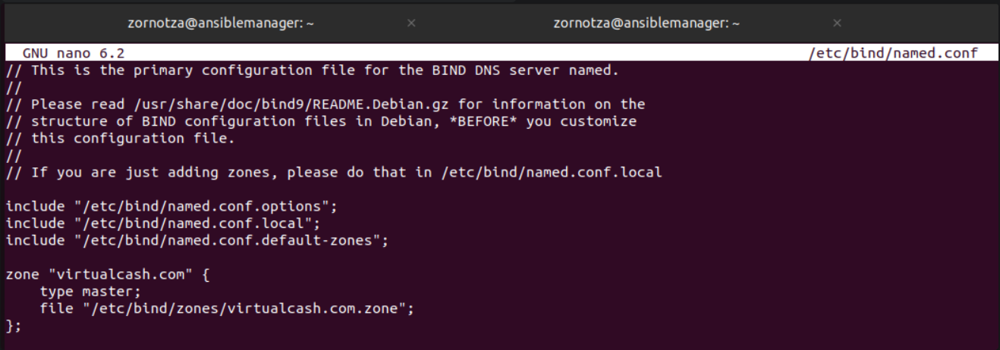
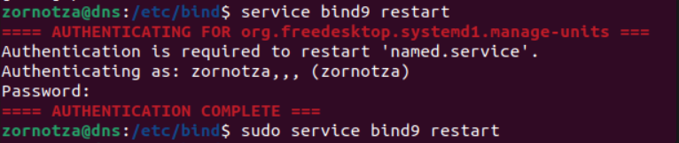

# DESPLIEGUE RETO 4


## INSTALACIÓN BÁSICA

### CONFIGURACIÓN DE LAS IP
- Configuramos la ip de cada máquina en el segundo adaptador de red para que puedan verse entre ellas.  

	>Ansible: 192.168.x.10
	>
	>MariaDB: 192.168.x.11
	>
	>Apache + PHP: 192.168.x.12
	>
	>DNS: 192.168.x.13

	Y con un ping, cualquier ip de otra de las máquinas se verán entre ellas.

	en el segundo adaptador de red haremos la siguiente configuración

	
	
	

- ### INSTALACIÓN DE OPENSSH

	`instalar openssh en todas las máquinas.`

	`sudo apt install openssh-server`

- ### CONFIGURACIÓN DE HOSTS Y HOSTNAMES

	configuramos el hosts y el hostname para cada una de las máquinas (apache, mariadb, dns)
    
	`nano etc/hosts`
	
	
    
	`nano etc/hostname`
    
	

- ### CONEXIÓN POR SSH

    Mediante ssh puedes conectarte a las otras máquinas y configurarlas

    `ssh (usuario)@192.168.1.(ipdelamaquina)`
    
 - ### CONFIGURACION DE HOSTS

	Le daremos un nombre de dominio a cada máquina, que más tarde resolverá el dns.
	 
## SERVIDOR ANSIBLE 

- Actualiza el índice de paquetes:

    `sudo apt update`

    `sudo apt upgrade`

- Instala Ansible:

	`sudo apt-add-repository ppa:ansible/ansible`

	`sudo apt install ansible`

	`sudo apt install ansible -y`

- Configuración de Ansible:

	crea una carpeta para alojar el despliegue. (RUTA: /home/zornotza)

    `mkdir despliegue`

    crea el archivo ansible.cfg para configurar ansible  

    `ansible-config init --disabled > ansible.cfg`


- Configuramos el .conf  

    

- Creamos la key de ssh(ssh keygen)

	`ssh-keygen`

	

	

- Creamos la carpeta inventory:

    `mkdir inventory`

- Añadimos el archivo hosts.ini a la carpeta inventory que le indicará al ansible las máquinas de la red:

    `sudo nano hosts.ini`

    y configuramos las 3 máquinas

- Comprobar conectividad con las maquinas de nuestra red

	

- Configuración de Playbook

	`sudo nano instalar_servicios.yml`

	
	
	```yml
	- name: Install Bind DNS software
	hosts: dns
	become: yes
	tasks:
		- name: Update package cache
		apt:
			update_cache: yes

		- name: Install Bind DNS
		apt:
			name: bind9
			state: present
	- name: Install Apache + PHP
	hosts: apache 
	become: yes
	tasks:
		- name: Update package cache
		apt:
			update_cache: yes

		- name: Install Apache and PHP
		apt:
			name:
			- apache2
			- php
			- libapache2-mod-php
			state: present
	- name: Install MariaDB
	hosts: mariadb 
	become: yes
	tasks:
		- name: Update package cache
		apt:
			update_cache: yes

		- name: Install MariaDB
		apt:
			name: mariadb-server
			state: present
	```

- Una vez configurado enviamos los archivos a las otras máquinas para su instalación:

	`ansible-playbook -i inventory/hosts.ini instalar_servicios.yml --ask-become-pass`

	Y listo, cada máquina tendría su servicio instalado.

## SERVIDOR APACHE 
- Actualizar el sistema

	Antes de instalar Apache, es una buena práctica asegurarse de que el sistema esté actualizado. Puedes hacerlo ejecutando:

	`sudo apt update`

	`sudo apt upgrade`

- Instalar Apache

	Una vez que el sistema esté actualizado, puedes instalar Apache usando `apt`:

	`sudo apt install apache2`

- Verificar el estado de Apache

	Después de la instalación, puedes verificar si Apache se está ejecutando correctamente usando:

	`sudo systemctl status apache2`

	Este comando te mostrará el estado actual del servicio Apache y te permitirá saber si se está ejecutando correctamente.

- Configurar el cortafuegos (firewall)

	Si estás utilizando un cortafuegos, necesitarás abrir el puerto 80 (HTTP) para permitir el tráfico web. Puedes hacerlo ejecutando:

	`sudo ufw allow 'Apache'`

- Acceder al servidor web

	Una vez que Apache esté instalado y en funcionamiento, puedes acceder a tu servidor web ingresando la dirección IP pública del servidor en un navegador web. Verás la página de inicio predeterminada de Apache.

- Archivos de configuración principales

	Los archivos de configuración principales de Apache se encuentran en el directorio `/etc/apache2/`. Los archivos más importantes son:

	- `apache2.conf`: El archivo principal de configuración de Apache.
	- `sites-available/`: Directorio que contiene los archivos de configuración de los sitios disponibles.
	- `sites-enabled/`: Directorio que contiene los enlaces simbólicos a los archivos de configuración de los sitios activados.

- Administración de sitios virtuales

	Puedes crear y administrar sitios virtuales (vhosts) para alojar varios sitios web en un solo servidor. Los archivos de configuración de los sitios virtuales se encuentran en el directorio
	
	`/etc/apache2/sites-available/`.

- Reiniciar Apache

	Si realizas cambios en la configuración de Apache, deberás reiniciar el servicio para que los cambios surtan efecto:

	`sudo systemctl restart apache2`

- Verificación de la instalación

	Para verificar que Apache se ha instalado correctamente, abre un navegador web y accede a la dirección IP pública de tu servidor. Deberías ver la página de inicio predeterminada de Apache.

## SERVIDOR DNS
- En caso de no haber instalado bind9 mediante ansible

	`apt-get install bind9`

- modificamos el archivo named.conf.local

	`sudo nano /etc/bind/named.conf.local`

- Añadimos la nueva zona:

	```bash
	zone "nombre_de_dominio.com" {
    type master;
    file "/etc/bind/zones/nombre_de_dominio.com.zone";
	};
	```

	

- Ya que hemos señalado que la zona estará en la carpeta zonas debemos crearla 

	(estando en la ruta /etc/bind)

	`mkdir zones`

- Crear archivo de zona para las redirecciones:
	Copiamos el archivo por defecto de la zona y creamos el nuestro

	`sudo cp /etc/bind/db.local /etc/bind/zones/nombre_de_dominio.com.zone`
	
- Editamos este archivo:

	`sudo nano /etc/bind/zones/nombre_de_dominio.com.zone`

	

	```bash
	$TTL    604800
	@       IN      SOA     nombre_de_dominio.com. root.nombre_de_dominio.com. (
							  2         ; Serial
						 604800         ; Refresh
						  86400         ; Retry
						2419200         ; Expire
						 604800 )       ; Negative Cache TTL
	;
	@       IN      NS      nombre_de_dominio.com.
	@       IN      A       192.168.1.12
	ansible IN      A       192.168.1.10
	bdd     IN      A       192.168.1.11
	dns     IN      A       192.168.1.13
	www     IN      CNAME   nombre_de_dominio.com
	```

	Tipos de registros de DNS usados:

	A: apunta a una IP. El servidor de destino es el encargado de tratar la solicitud entrante. Hay que tener en cuenta si la IP destino es fija o dinámica. Ejemplo: 192.168.1.104

	CNAME: apunta a otro dominio o a otro subdominio. Ejemplo: blog.example.com

	la @ es un subdominio que apunta al root(el nombre base) del dominio
	si tu dominio completo es apache.grupo1.com
	la @ (el root) apuntaría a: grupo1.com

- Reseteamos el servicio

	

	`sudo service bind9 restart`
	
## SERVIDOR MARIADB 

- Importar la base de datos:

	Importamos la base de datos mediante scp, o cualquier otro servicio, en nuestro caso la hemos importado desde google drive.

- una vez importada, iniciaremos mysql

	- PROBLEMA CON EL USUARIO Y CONTRASEÑA

		al intentar acceder a mysql, nos daba error así que lo iniciamos en modo seguro para cambiar la contraseña y el usuario a la de nuestro interés
		
		Detenemos el servicio mysql:

		```sudo systemctl stop mysql```
		
		Iniciamos el servicio en modo seguro haciendo que no se apliquen las reglas de autenticación y podamos acceder sin contraseña:

		```sudo mysqld_safe --skip-grant-tables &```
		
		Entramos con el usuario root:

		```mysql -u root```
		
		Cambiamos la contraseña del usuario:

		```ALTER USER 'root'@'localhost' IDENTIFIED BY 'nueva_contraseña';```
		
		Si iniciamos el servidor en modo seguro debemos tener esto en cuenta si más adelante queremos pararlo o reiniciarlo, ya que el reinicio normal del servicio (`systemctl restart mariadb`) no tiene efecto en la configuración, porque el servidor no aplica las reglas de autenticación normales
		
		Detenemos el proceso mysqld_safe:

		```sudo pkill -f mysqld_safe```
		
		Inicia el servidor MariaDB normalmente:

		`sudo systemctl start mariadb`
		
	- SI da problemas iniciar mysql en modo sudo (el usuario por defecto es "root")

		`sudo mysql -u tu_usuario -p`
		
	- Crear la base de datos

		```CREATE DATABASE nombre_bdd```
		
	- Ahora importaremos el .sql a la base de datos de nuestro mariadb
		seleccionamos la base de datos

		```USE nombre_bdd```

		importamos los datos

		`source ruta_del_archivo_sql`

		ej: `source /var/lib/mysql/banca_def.sql`
		
		comprobamos si existen datos en la base de datos 
		(teniendo seleccionada la base de datos "USE nombre_bbdd;", importante poner ";")

		```SHOW TABLES;```

	### Configuración de php para la base de datos

	- para hacer funcionar la base de datos ya que en el proyecto usamos php es necesario instalar el controlador de base de datos y hacer unas configuraciones

		`sudo apt install php-mysql`

	- #### Configurar el php.ini
	
		- Buscar el archivo php.ini

			`cd /etc/php/`
			
			tabularemos hasta encontrar la carpeta en la que aparece la version de nuestro php

			Ejemplo: `/etc/php/7.4/apache2/php.ini`

			si no encuentras la carpeta puedes comprobar la version con:

			`php -v`

			una vez localizada la carpeta

			`sudo nano /etc/php/(version_de_php)/php.ini`

		- Editar el archivo
			
			buscamos la siguiente linea:

			con __Cntrl + W__ puedes hacer búsquedas en ubuntu

			con el buscador abierto escribes:

			>extension=mysqli

			tendremos que usar el __Cntrl + W__ hasta encontrar la segunda linea que menciona el extension=mysqli y descomentarla

			en el mismo archivo buscamos las siguientes lineas:

			>mysqli.default_host = "localhost"

			>mysqli.default_user = "tu_usuario_mysql"

			>mysqli.default_pw = "tu_contraseña_mysql"

			es importante configurar correctamente en el archivo del model de tu web en el que estableces los anteriores tres parametros

			en el host se pondrá el nomre de dominio del servidor bdd

			en el user, el nombre de usuario

			en el pw, la contraseña del usuario de la bdd